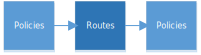
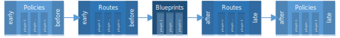

# Routing Basics

Hitchy's core essentially features two jobs:

* discovering extensions and
* routing requests to its designated handler

This chapter is about the latter job and understanding it is essential for properly building applications with Hitchy. We will introduce the essential terms _routes_ and _policies_ you definitely need to become familiar with.  

## Basic Terms

### Routes

Hitchy is an HTTP-based service responding to incoming requests using handlers. Except for some error responders there is no such handler bundled with Hitchy. Just remember: Hitchy starts lean. It is up to you to fill the gaps with existing plugins or your own code.

In HTTP every request selects some entity on a server using a path name.

::: tip Example  
When opening URL `http://cepharum.de/path/of/resource.html` in a browser 

* the protocol HTTP is picked to send a request 
* to a server named `cepharum.de` 
* for processing and returning information regarding some entity identified by its path `/path/of/resource.html`.

In HTTP servers are assumed to expose a hierarchy of addressable entities. And the path is picking a part of hierarchy you are interested in when sending a request.  
:::
 
Hitchy's request dispatching capabilities are meant to find some code to answer requests. The request's path is essential to selecting one out of several defined _request handlers_. Associating a request's path with a particular handler is called a _route_.

In Hitchy this rather generic term is refined to cover particular kind of handlers, only. Here, a route is always assumed to actually send some response. Because of that there is always at most one such route handling a particular request.

### Policies

Relying only on such routes would be very limiting with regards to customizing request handlers, applying common behaviour to a set of handlers and supporting plugins introducing additional features for every request handled. That's why there is a second kind of routes which is managed and behaving differently from those routes described before. This additional kind of routes are called _policies_ and they are very important building bricks for assembling your applications from lots of useful small components over and over again.

::: tip Stick with the wording
Talking about _routes_ in Hitchy documentation always refers to those routes described above. When talking about this other kind of "routes" the term _policies_ is used. 

_Routing_ as a process is always involving both policies and routes.
:::

#### Commonalities

Policies and routes have these things in common:

* Both are associating some path with code _handling_ any matching request. This code is thus called a _request handler_ or just _handler_.

* Handlers are capable of responding to a request in either context.

#### Differences

Policies are different from routes, though:

* Policies might associated multiple handlers with a single path.

* In opposition to routes policies are processed when matching prefix of an incoming request's path. Routes require to match the path as a whole.

* That's why every incoming request may be dispatched to a sequence of matching policies with each policy probably selecting multiple handlers to invoke.

* There may be multiple routes matching a request's path as well, but only the first one is used to respond.

* Handlers attached to a policy are meant to return control to Hitchy to continue route dispatching unless they are responding to the request themselves.

## Sequential Routing

### Routing Stages

On every incoming request Hitchy is processing configured policies and routes in a particular order.

1. Every request is passing zero or more policies matching the request.

2. After that a route is looked up for matching the request and respond to it. The first matching route is picked.

3. After responding another set of policies might be passed if matching request. Those policies can't respond to a request by intention but are available to post-process requests e.g. by releasing resources, logging times taken to respond etc.

::: warning Note  
There are routing stages **before** and **after** routes.  
:::

### Aggregated Configuration 

To understand the following chapters on routing stages and slots it is important to know how policies and routes are configured from a distant point of view.

The configuration of policies and routes is always aggregated from different sources and merged according to some internal set of rules. Basically there are two kinds of sources capable of defining policies and/or routes:

1. [Plugins](../internals/architecture-basics.md#plugins) may define policies and/or routes in Hitchy's configuration phase during boot-up. They are _plugin-related_.

2. The project relying on Hitchy as a framework - your application - may define policies and/or routes as well. These are called _custom_ policies and routes.

### Focusing On Routes

In chart above a single stage was displayed regarding routes. However, the stage covering routes is slightly more complex:

This chart introduces another stage in between of two stages with "regular" routes. The term _blueprints_ refers to one or more sets of related routes. They are different from those "regular" routes in context of routing configuration, only.

::: tip Background  
Blueprints as a pattern have been adopted from existing server-side frameworks such as [Sails](https://sailsjs.com/documentation/concepts/blueprints).  
:::

Blueprints are created by plugins, only. They usually depend on related data to be exposed using a complete set of routes enabling to manage that data.

Collecting such blueprints in a separate stage as illustrated before is essential for flexibly integrating them into different kinds of applications. By splitting up the stage of routes into three different stages with the blueprint routes processed between two separate stages for non-blueprint routes an application and its plugins may

* add routes that "replace" routes of a blueprint by being associated with the stage preceding the blueprint stage or

* provide fallback routes to use if some optionally supported blueprint is missing.

::: warning Note  
There are stages for routes being explicitly obeyed **before** or **after** routes of blueprints.
:::

### Routing Slots

In either of the five stages described before multiple policies or routes can be configured. But even in scope of a single stage the routing keeps processing configured policies and routes sequentially. That's why controlling order of configured policies/routes per stage is important.

Stages are divided into _slots_ as illustrated in the following chart:

* In every stage there is a separate slot for either discovered plugin.

  ::: tip  
  The discovery of plugins always results in a certain order of plugins which depends on either plugin selecting other plugins it depends on. A plugin depending on another plugin is always processed after the one it depends on.  
  :::
  
  With regards to the order of discovered plugins their configured policies and routes are processed 
  
  * in same order in stages before the blueprint stage and

  * in reverse order in stages following the blueprint stage.

* In every stage but the blueprint stage there are two additional slots for prepending or appending custom policies or routes via your application's configuration:

  * Policies or routes in the **early** slot are processed before any policy or route configured by a plugin in same stage and before the blueprints.

  * Policies or routes in the **before** slot are processed after any policy or route configured by a plugin in same stage, but before the blueprints.

  * Policies or routes in the **after** slot are processed after the blueprints, but before any policy or route configured by a plugin in same stage.

  * Policies or routes in the **late** slot are processed after the blueprints and after any policy or route configured by a plugin in same stage.

::: warning Note
* Plugins have their individual slot in every stage of routing to add their policies and routes.
* An application's definition of policies and routes can name slots to prepend or append them to either stage's set of plugin-related slots.
  * Those slots are named **early**, **before**, **after** and **late**.
:::

## Routing Optimizations

Hitchy is discovering available plugins, gathering their routing configurations and merging them with the application's configuration of custom policies and routes. After that all routing data is optimized for dispatching requests as fast as possible.

After aggregating all the different configurations Hitchy the separation into slots is dropped. Blueprint routes are appended to the preceding stage of routes. As a result there are two blocks of configured policies and two blocks of configured routes.

For every such block the configured policies/routes are grouped by HTTP method. Those policies/routes defined to apply to all HTTP methods are redundantly listed in either resulting group.

For every method-related group in every policy-related block sequences of policies are grouped by their prefix. Policies with shorter prefix are redundantly listed in groups for longer prefixes as well.

For every method-related group in first of the two route-related blocks the routes of same group in second block are appended. This results in a single block with sequences of applicable routes grouped by HTTP method. Eventually every method-related group of routes is grouped by prefix similar to policies.

## Request Matching

Given an actual request policies and routes are matching slightly differently:

* A policy is matching a request when the request's actual path _starts with_ the path used to define the policy.

* A route is matching a request when the request's actual path _is equivalent to_ the path used to define the route.

There are commonalities in matching both kinds as well:

* In both cases matching covers HTTP methods used. Thus, matching path isn't sufficient if there is a particular HTTP method required to match as well. The method always has to match as a whole.

* In either case a path can be described by a pattern resulting in multiple different paths matching this pattern.

### Multiple Matches
 
Routing a particular request frequently results in multiple matching policies and routes. This might be due to

* your application as well as used plugins configure policies/routes for the same path,

* policies/routes for the same path are configured in different routing stages,

* having an intersection of matching paths when using path patterns or

* different policies share a common prefix

### Dispatching Order

On incoming requests Hitchy is iterating over the three blocks resulting from the optimization as described before.

* In every block the group matching the requested HTTP method is looked up. As a result an existing set of policies or routes grouped by prefix is fetched. If there is no group for the requested method the block is skipped as a whole.

* The longest prefix matching current request is selected resulting in a sequence of policies or routes.

  In processing policies this is used to get all the policies to be obeyed. In processing routes this is used to improve routing performance by limiting the number of routes that need to be looked up for a route matching current request.

* When processing a sequence of policies, for every policy in resulting sequence the associated handlers are invoked.

  When processing a sequence of routes, the first route of resulting sequence matching request's path as a whole is searched and its handler is invoked. If there is no matching route Hitchy responses with a response with HTTP status code 404 by default.
